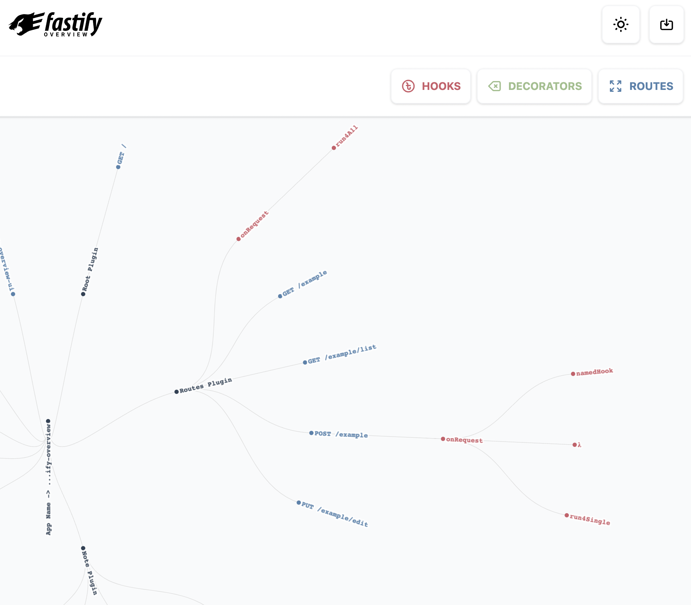
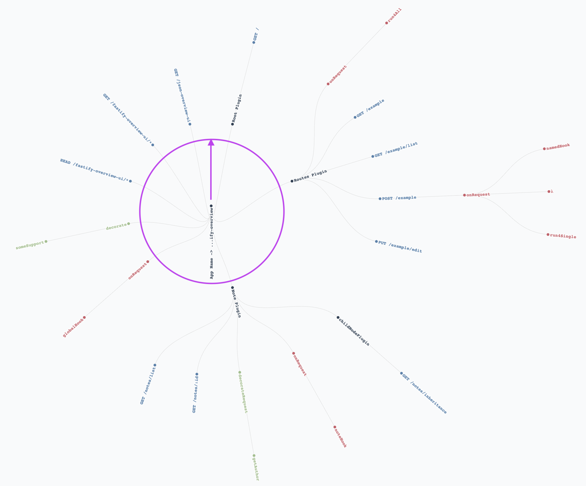

# 📊 fastify-overview-ui

UI for [fastify-overview's](https://github.com/Eomm/fastify-overview) graphic representation.

This plugin will generate a UI to visualize the structure of your fastify application.
Here is a simple example of what you will see:



The previous image shows the home page of the UI.
It contains a [Radial tree](https://en.wikipedia.org/wiki/Radial_tree) visualization.
The graph can be zoomed and panned to explor it regardless its dimensions.
It describes the structure of your application:

- the center of the tree is the root of your fastify application
- every `black` node is a fastify context
- every `red` node is a hook
- every `green` node is a decorator
- every `blue` node is a route

So, by reading the graph you can understand the structure of your application and
the functions that is beeing executed whenever a route handler is called.
To lean how to read the graph, please read the following documentation.

## Setup

```bash
npm i fastify-overview fastify-overview-ui
```

Note: This plugin requires `fastify-overview` to be installed ([usage instructions](https://github.com/Eomm/fastify-overview#usage)).

## Usage

```js
await fastify.register(require('fastify-overview'), {...})
await fastify.register(require('fastify-overview-ui'))
```

The UI will be available at `{your app's url}/fastify-overview-ui`

## How to read the graph

The radial graph must be read from the center to the circle outside, in clockwise direction starting from the 12:00 position _(see the fucsia trace)_:



So, reading the example image above, you can understand the following:

1. The `Root plugin` is loaded first
2. The `Routes plugin` is loaded next
3. The `Note plugin` is loaded next
4. The `childNodePlugin` is loaded last

Every `black` node is a fastify context that may contain hooks, decorators and routes.
Thanks to the [encapsulation](https://www.fastify.io/docs/latest/Reference/Encapsulation/#encapsulation)
every context has a parent context and it inherits all the hooks, decorators and routes from its parent context.

For example: the `GET /note/inheritance` route is a child of the `Note plugin` context.
This means that, when a client will call that route, the parents' hooks will be executed first:
- The `globalHook` will be executed first because it is nearest to the center of the graph
- Then the  `noteHook` function will be executed because it is a hook of the `Note plugin` context.

Moreover, the route handler can access the `someSupport` and `getAuthor` decorators because they are inherited from parents nodes.

As exercise, you can read the graph and understand the hooks that are executed when the `/example/list` route is called.

## Running the example

An example application is provided which can be used to try out the plugin.

- `npm run build`
- `cd example`
- `npm run dev`
- open `http://localhost:3000/fastify-overview-ui`

This will use the built version of the application. For developing the plugin see the next section.

## Development

An example application is provided which can be used to develop the plugin locally while using the development version of the source code of the client application.

- run `npm run dev` in the `example/` folder
- run `npm run dev` in the root folder
- open `http://localhost:3001`
- make changes to the client codebase and see them reflected in the UI live

## Radial mockups

Design proposal can be found in [this Figma file](https://www.figma.com/file/tt4BtV637DtdJpfdhriBWR/Fastify?node-id=0%3A1).

## License

Licensed under [MIT](./LICENSE).
